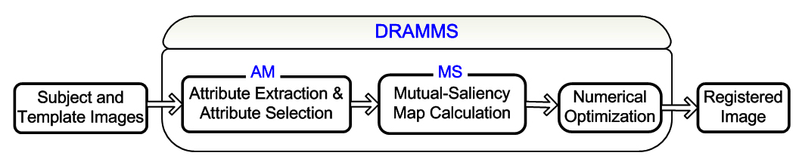
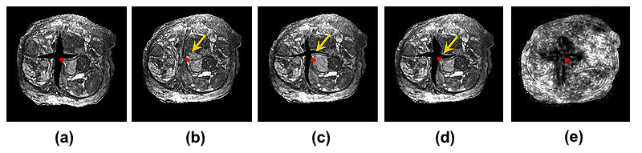

.. raw:: html

   <!--

   ============================================================================

      DO NOT EDIT THIS FILE! It was generated using Sphinx from:

      Origin:   $URL: https://sbia-svn.uphs.upenn.edu/projects/DRAMMS/branches/dramms-1.4/doc/about.rst $
      Revision: $Rev: 1900 $

   ============================================================================

   -->

.. title:: About DRAMMS Algorithm

.. meta::
   :description: Brief overview of DRAMMS algorithm. Attribute Matching and Mutual-Saliency Weighting.
   :keywords: DRAMMS Algorithm.
 

.. raw:: latex

    \pagebreak

====================
About the Algorithm
====================

DRAMMS consists of two major components -- attribute matching (AM) and mutual-saliency (MS) weighting. A systematic sketch is shown in the following figure.

.. _fig_framework:

Attribute Matching (AM)
=======================

DRAMMS characterizes each voxel by the geometric texture attributes around this voxel. We extract multi-scale and multi-resolution Gabor attributes at each voxel, selects the optimal components, and assembles them into a high-dimensional attribute vector for describing each voxel. 

Compared to the traditionally used intensity information, texture attributes are more informative. Therefore, each voxel is more distinctive, and finding its correspondence becomes more accurate. This is demonstrated in the following figure. In this figure, we calculate similarities between a red/blue point in the subject image and all voxels in the template image. The similarity is inverse proportional to the difference between attributes. Using the optimal Gabor attributes, there is a smaller number of candidates in the template image to match up with red/blue voxel in the subject image.

.. _fig_attributes:

.. only:: html
    
    .. figure::   RoleOfOptimalAttributes.jpg
       :alt:      Effect of describing voxels using different types of attributes.
       :align:    center
       :width:    90%
       :figwidth: 90%

.. only:: latex
    
    .. figure::   RoleOfOptimalAttributes.jpg
       :alt:      Effect of describing voxels using different types of attributes.
       :align:    center
       :width:    75%
       :figwidth: 75%

Mutual-Saliency (MS) Weighting
==============================

Some anatomical structures can find correspondences more easily and reliably than other anatomical structures. Ideally, a registration process should use all voxels, but be mainly driven by the regions that can establish reliable correspondences. The proposed "mutual-saliency" metric automates this process. It automatically assigns different weights to different voxels based on automatically quantifying how much confidence we have for a voxel to find reliable correspondences in the other image. 

This is especially useful when registering images with missing correspondences (or missing data, or outlier regions), such as the pathologies (vascular lesions, tumors) in the images. The automatically-calculated mutual-saliency map reduces the negative impact of the outlier regions.

The following figure demonstrates the effect of the mutual-saliency weighting. Given the template image (b), we have simulated a cross-shaped cut as well as non-rigid deformations, resulting in the simulated subject image (a). The registration is from (a) to (b), and we want to demonstrate how the mutual-saliency metric helps reduce the negative impact of the simulated cut, which does not have a counterpart in the other image. For comparison, a red point is noted in all subfigures to represent the same exact spatial locations. It is the truly corresponding point that we use to evaluate registration accuracy in this region. Registration between (a) and (b) without the mutual-saliency weighting forces other regions to fill into the simulated cut, causing artificial results such as the stitches in the resultant image (c). As a result, the true correspondence is lost. On the contrary, the mutual saliency map in (e) assigns low weights to the cut regions because of the automatic quantification of the lack of reliable correspondences in this region. Therefore, registration with mutual-saliency weighting leads to the result in (d), which is more anatomically meaningful and preserves the true correspondence. 

.. _fig_confidencemap:

