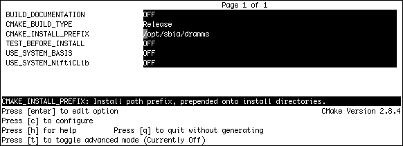

.. raw:: html

   <!--

   ============================================================================

      DO NOT EDIT THIS FILE! It was generated using Sphinx from:

      Origin:   $URL: https://sbia-svn.uphs.upenn.edu/projects/DRAMMS/branches/dramms-1.4/doc/installation.rst $
      Revision: $Rev: 2055 $

   ============================================================================

   -->

.. title:: Installation of DRAMMS Software

.. meta::
   :description: How to install DRAMMS software, a step-by-step guide.
   :keywords: DRAMMS Installation, DRAMMS Install, DRAMMS Configuration, DRAMMS Setup.
 

============
Installation
============

Prerequisites
=============

.. raw:: html

     

+----------------+----------+-------------------------------------------------------------+
| Dependency     | Version  | Description                                                 |
+================+==========+=============================================================+
| CMake_         | 2.8.4    | To compile and build DRAMMS. Use version 2.8.4 -- 2.8.9.    |
+----------------+----------+-------------------------------------------------------------+
| FSL_           | 4.1.5    | FLIRT_ is used for affine registration.                     |
+----------------+----------+-------------------------------------------------------------+
| NiftiClib_     | 2.0.0    | To provide NIfTI-1_ support.                                |
+----------------+----------+-------------------------------------------------------------+
| BASIS_         | 2.1.4    | A SBIA meta-project to standardize software development.    | 
+----------------+----------+-------------------------------------------------------------+
| FastPD_        |          | The `Demo version <http://www.csd.uoc.gr/~komod/FastPD/>`__ |
|                |          | provided by the author of FastPD must be patched for use    |
|                |          | with DRAMMS (see :doc:`here <fastpd>`).                     |
+----------------+----------+-------------------------------------------------------------+

.. raw:: html

     

Out of these five dependencies: 

 users need to install two dependencies --- CMake_ and FSL_ --- before DRAMMS installation;

 users need **not** to install the other three dependencies --- BASIS_, NiftiCLib_, and FastPD_
 are by default built as part of the build and installation as described below.

.. raw:: html

     

	
Build and Installation
======================

Please follow commands below in a shell/terminal (e.g., Bash_). They will configure and build DRAMMS using `GNU Make`_. 
The main CMake configuration file (``CMakeLists.txt``) is located in the ``dramms-$version-source/build/`` subdirectory.

.. raw:: html

     

**Step 1. Extract source files**::

    tar xzf dramms-${version}-source.tar.gz

	
.. raw:: html

     	
	
	
	
**Step 2. Change to the build directory**::

    cd dramms-${version}-source/build

	
.. raw:: html

     
	
	
	
**Step 3. Run CMake to configure the build tree**::

    ccmake .

After the execution of this command, you will see a screen like below (`Fig_ccmake`_). 

.. _`Fig_ccmake`:

   
   Fig_ccmake: Configuring dramms installation using ``ccmake``.

.. raw:: latex

    \clearpage

In this ccmake interface, please do:

 3.1.  Change ``CMAKE_INSTALL_PREFIX`` to the folder you want to install DRAMMS into. This folder should be outside the ``dramms-${version}-source`` folder. Make sure you have the **write** access to this folder.

 3.2.  Keep pressing letter ``c`` on your keyboard until option ``g`` is available/displayed on the screen.

 3.3.  Then press ``g`` on your keyboard to generate the makefiles and to quit this ccmake window.

.. raw:: html

      

**Step 4. Build and install DRAMMS**::

    make
 
Upon the success of the above compilation and build process, DRAMMS is installed into the directory
specified by the ``CMAKE_INSTALL_PREFIX`` (set during build configuration in step 3).
The DRAMMS :ref:`Command-line Tools <CommandLineTools>` are located in the ``bin/`` subdirectory.

.. raw:: html

     
     

.. note:: If the automatic build of BASIS, the NiftiCLib, or FastPD fails, please build and install
          these packages separately before the build of DRAMMS.
          Note that in case of FastPD, the original implementation of Nikos Komodakis has to be patched
          before it can be used with DRAMMS. See the :doc:`fastpd` guide for details.
          
          Then follow steps 1-4 above, where the CMake options ``USE_SYSTEM_BASIS``, ``USE_SYSTEM_NiftiCLib``,
          and/or ``USE_SYSTEM_DRAMMSFastPD`` have to be set to ON in step 3.
          Ensure further that the ``BASIS_DIR``, ``NiftiCLib_DIR``, and ``DRAMMSFastPD_DIR``
          CMake variables point to the installed prerequisite packages (after the configuration step).

.. toctree::
    :hidden:
    
    fastpd

.. _CMake:     http://www.cmake.org/cmake/resources/software.html
.. _GNU Make:  http://www.gnu.org/software/make/
.. _FSL :      http://www.fmrib.ox.ac.uk/fsl/fsl/downloading.html
.. _FLIRT:     http://fsl.fmrib.ox.ac.uk/fsl/fslwiki/FLIRT
.. _NiftiClib: http://sourceforge.net/projects/niftilib/files/nifticlib/
.. _NIfTI-1:   http://nifti.nimh.nih.gov/nifti-1/
.. _Bash:      http://www.gnu.org/software/bash/
.. _BASIS:     http://www.rad.upenn.edu/sbia/software/basis/
.. _FastPD:    http://www.csd.uoc.gr/~komod/FastPD/
.. _BASIS how-to guide on software installation: http://www.rad.upenn.edu/sbia/software/basis/howto/install.html#building-from-sources
