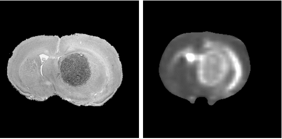
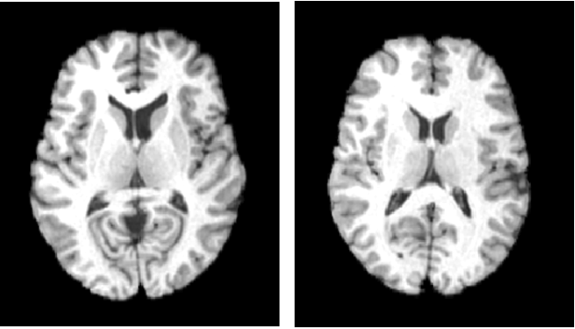
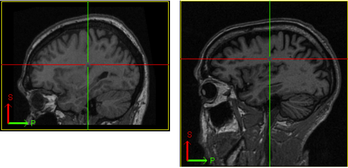
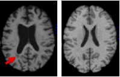
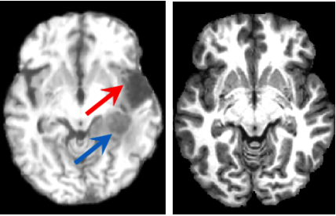
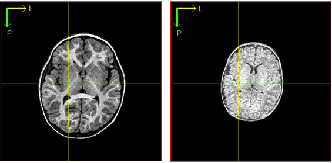
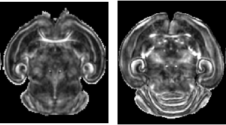
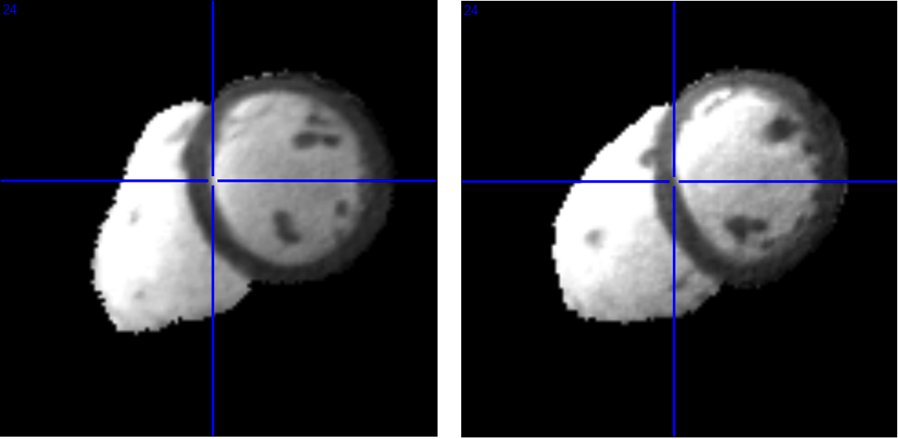
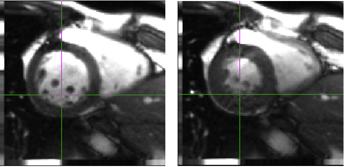
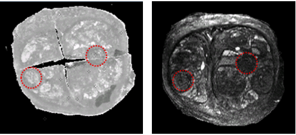

.. raw:: html

   <!--

   ============================================================================

      DO NOT EDIT THIS FILE! It was generated using Sphinx from:

      Origin:   $URL: https://sbia-svn.uphs.upenn.edu/projects/DRAMMS/branches/dramms-1.4/doc/tutorials.rst $
      Revision: $Rev: 1846 $

   ============================================================================

   -->

.. title:: DRAMMS Tutorials

.. meta::
   :description: Examples and Tutorials of DRAMMS. What DRAMMS can do and how to use DRAMMS in different image registration tasks.
   :keywords: DRAMMS Examples, DRAMMS Tutorials, DRAMMS How-to, DRAMMS Documentation, Deformable Registration, Non-rigid Registration, Registration with Outliers, Registration with missing data, Registration with missing correspondence, Brain Registration, Cardiac Registration, Breast Registration, Prostate Registration, Registration with Lesions, Registration with Tumors, Longitudinal Registration, Cross-subject Registration, Multi-modality Registration.

.. Page break after table of contents in LaTeX/PDF output.
.. raw:: latex

    \pagebreak

.. _Tutorials:

Tutorials
=========

.. only:: html
    
    .. tip:: Click the figures or links in each case to see details about
              i) **results**,
              ii) **command**,
              iii) **resources needed**, and 
              iv) **other useful options**.

	
2D Images
---------

.. only:: html
    
    .. csv-table::
        :class: exampletoctable cases2d

        |2DSimulatedC|, |2DHistMRC|
        |2DSimulated|,  |2DHistMR|

.. |2DSimulatedC| replace:: `Simulated <tutorials/2DSimulated.html>`__

.. |2DHistMRC| replace:: `Histology/MR Mouse Brain <tutorials/2DHistMR.html>`__

.. toctree::
    :hidden:

    tutorials/2DSimulated
    tutorials/2DHistMR

 

 
3D Brain Images
---------------

.. only:: html
    
    .. csv-table::
        :class: exampletoctable brain3d

        |BrainSkullStrippedC|, |BrainWithSkullC|,           |PediatricBrainLongitudinalC|
        |BrainSkullStripped|,  |BrainWithSkull|,            |PediatricBrainLongitudinal| 
        |BrainWithLesionC|,    |BrainWithTumorRecurrenceC|, |MouseBrainLongitudinalC|
        |BrainWithLesion|,     |BrainWithTumorRecurrence|,  |MouseBrainLongitudinal|

.. |BrainSkullStrippedC| replace:: `Skull-stripped <tutorials/BrainSkullStripped.html>`__

.. |BrainWithSkullC| replace:: `With Skull, Raw Images <tutorials/BrainWithSkull.html>`__

.. |BrainWithLesionC| replace:: `With Lesion <tutorials/BrainWithLesion.html>`__

.. |BrainWithTumorRecurrenceC| replace:: `With Tumor Recurrence <tutorials/BrainWithTumorRecurrence.html>`__

.. |PediatricBrainLongitudinalC| replace:: `Pediatric, Longitudinal <tutorials/PediatricBrainLongitudinal.html>`__

.. |MouseBrainLongitudinalC| replace:: `Mouse Brain, Longitudinal <tutorials/MouseBrainLongitudinal.html>`__

.. toctree::
    :hidden:

    tutorials/BrainSkullStripped
    tutorials/BrainWithSkull
    tutorials/PediatricBrainLongitudinal
    tutorials/BrainWithLesion
    tutorials/BrainWithTumorRecurrence
    tutorials/MouseBrainLongitudinal

3D Cardiac Images
-----------------

.. only:: html
    
    .. csv-table::
        :class: exampletoctable cardiac3d

        |CardiacCrossSubjectsC|, |CardiacLongitudinalC|
        |CardiacCrossSubjects|,  |CardiacLongitudinal|

.. #|CardiacCrossSubjectsC| replace:: **Cross-Subjects, Pure Heart**
.. |CardiacCrossSubjectsC| replace:: `Cross-Subjects, Pure Heart <tutorials/CardiacCrossSubjects.html>`__

.. #|CardiacLongitudinalC| replace:: **Longitudinal**
.. |CardiacLongitudinalC| replace:: `Longitudinal <tutorials/CardiacLongitudinal.html>`__

.. toctree::
    :hidden:

    tutorials/CardiacCrossSubjects
    tutorials/CardiacLongitudinal

	

	
3D Breast Images
----------------

.. only:: html
    
    .. csv-table::
        :class: exampletoctable breast3d

        |BreastLongitudinalC|
        |BreastLongitudinal|

.. #|BreastLongitudinalC| replace:: **Longitudinal**
.. |BreastLongitudinalC| replace:: `Longitudinal <tutorials/BreastLongitudinal.html>`__

.. |BreastLongitudinal| image::  tutorials/intro3h_3DBreast_CancerGrowth.png
                        :alt:    Registration of breast images over time for the same subject.
                        :target: tutorials/BreastLongitudinal.html

.. toctree::
    :hidden:

    tutorials/BreastLongitudinal

	

	
	
3D Prostate Images
------------------

.. only:: html
    
    .. csv-table::
        :class: exampletoctable prostate3d

        |ProstateHist2MRIC|
        |ProstateHist2MRI|

.. #|ProstateHist2MRIC| replace:: **Multi-Modality (Histology/MRI)**
.. |ProstateHist2MRIC| replace:: `Multi-Modality (Histology/MRI) <tutorials/ProstateHist2MRI.html>`__

.. toctree::
    :hidden:

    tutorials/ProstateHist2MRI
