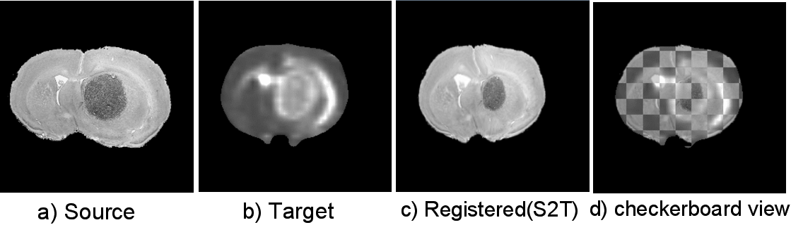

.. raw:: html

   <!--

   ============================================================================

      DO NOT EDIT THIS FILE! It was generated using Sphinx from:

      Origin:   $URL: https://sbia-svn.uphs.upenn.edu/projects/DRAMMS/branches/dramms-1.4/doc/tutorials/2DHistMR.rst $
      Revision: $Rev: 1900 $

   ============================================================================

   -->

.. title:: 2D Histology-to-MRI Registration by DRAMMS

.. Page break after table of contents in LaTeX/PDF output.
.. raw:: latex

    \pagebreak

Tutorial 2: 2D Histological and MR Images of The Same Mouse Brain
=================================================================

Result
------

.. _fig2b_3DMouseBrain_Histology2MRI:

   
   Registration of two 2D multi-modality (histology and MR) slices of a mouse brain.
   
   
   

Command
-------

::

    dramms -S src_2DHist.nii.gz  -T trg_2DMRI.nii.gz  
           -O src2trg.nii.gz     -D def_src2trg.nii.gz  -x 7

		   
Here, we have used option ``-x 7`` to place control points every 7 pixels in the x and y directions. If this option is not used, the program will place control points every ``int(${sizeX\}/25)`` (=10 in this 256 x 256 image) pixels, which was the case in another example regarding 2D simulated image. Placing denser control points in this example enables the program to capture more local deformations.

Resources Needed
----------------

Registering this pair of 2D images (256 x 256) takes 36MB memory and finishes in 1.3 min in Linux OS (2.80GHz CPU). Compared to 1.5 min computational time in the example of 2D simulated images, denser control point grids usually takes less computational time.

.. Start a new page in LaTeX/PDF output after the changes.
.. raw:: latex

    \clearpage
