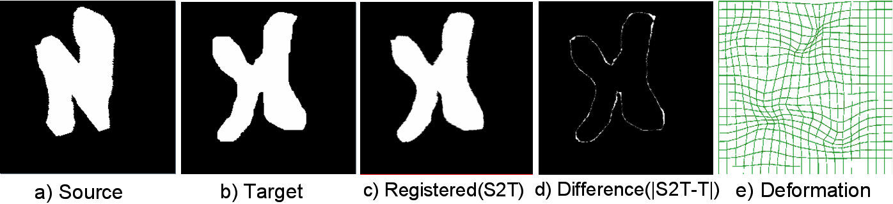

.. raw:: html

   <!--

   ============================================================================

      DO NOT EDIT THIS FILE! It was generated using Sphinx from:

      Origin:   $URL: https://sbia-svn.uphs.upenn.edu/projects/DRAMMS/branches/dramms-1.4/doc/tutorials/2DSimulated.rst $
      Revision: $Rev: 1776 $

   ============================================================================

   -->

.. title:: Registration of 2D Simulated Images by DRAMMS

Tutorial 1: 2D Simulated Images
================================

Introduction
-------------

This is like a "Hello World!" example of DRAMMS, to taste a little bit flavor of how DRAMMS works, and how its result/deformation looks like.

Result
------

.. _fig2a_2DSimulated:

   
   Registration of two 2D simulated images.
   
   

Command
-------

::

    dramms -S source.hdr  -T target.hdr
           -O S2T.hdr     -D def_S2T.nii.gz

Resources Needed
----------------

Registering this pair of 2D images (256 x 256) takes 42MB memory and finishes in 1.5 min in Linux OS (2.80GHz CPU).

.. Start a new page in LaTeX/PDF output after the changes.
.. raw:: latex

    \clearpage
