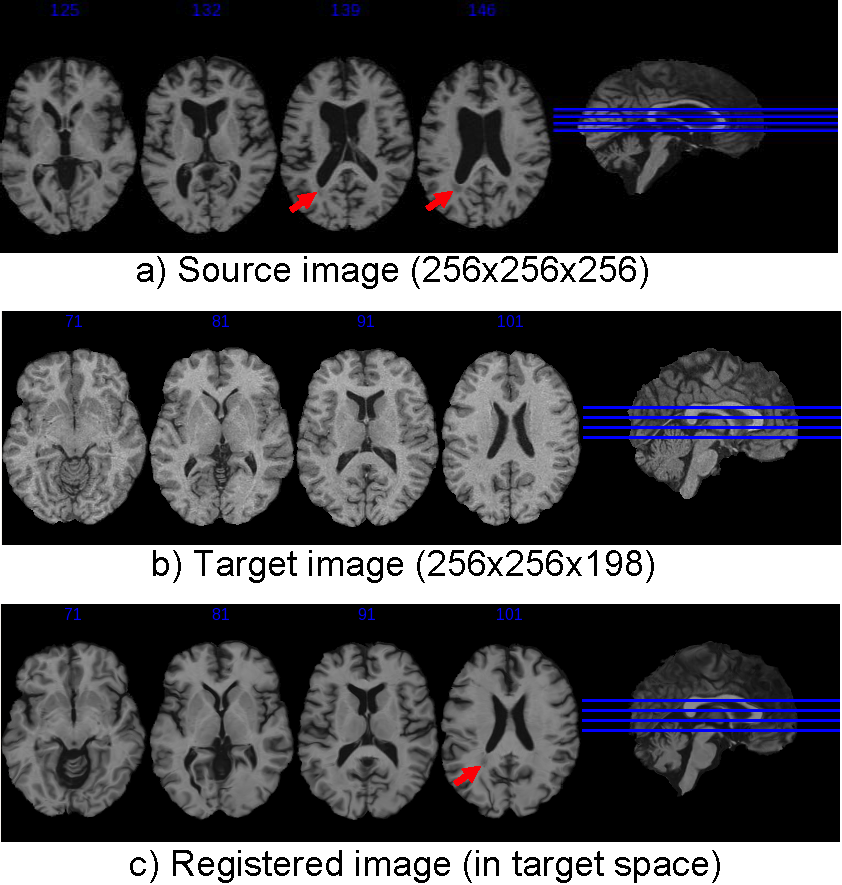

.. raw:: html

   <!--

   ============================================================================

      DO NOT EDIT THIS FILE! It was generated using Sphinx from:

      Origin:   $URL: https://sbia-svn.uphs.upenn.edu/projects/DRAMMS/branches/dramms-1.4/doc/tutorials/BrainWithLesion.rst $
      Revision: $Rev: 1900 $

   ============================================================================

   -->

.. title:: Lesion-bearing Brain Images Onto the Normal Template by DRAMMS

Tutorial 6: Lesion-Bearing Brain Onto a Normal Brain Template
===============================================================

Introduction
-------------

Registration from lesion-bearing brain images to a normal template can help us normalize a population of brains, all having lesions, into a same template space that presents the healthy anatomy. Then we can observe the spatial distributions of lesions, correlate the lesion occurrence with the functional deficit, and monitor the treatment effect.

The main difficulty is the missing correspondence problem --- lesions are present in patients' brain images but not in the normal template. The mutual-saliency component in DRAMMS helps alleviate this problem.

Result
------

.. _fig3c_3DLesionedBrain_NormalizationToTemplate:

   
   Registration of a 3D brain MR images with lesions (source) onto a healthy brain template (target). Red arrows point out lesions in the source image (a) and in the registered image (c). Because of mutual-saliency weighting, the negative impact of lesion is reduced. As a result, the surrounding normal regions are well aligned.
   
   
   
   
Command
-------

::

    dramms -S src_LesionedBrain.hdr -T trg_NormalTemplate.hdr
           -O src2trg.nii.gz        -D def_S2T.nii.gz        -c 2  

Here ``-c 2`` options turns on the mutual-saliency weighting part of DRAMMS. The mutual-saliency weight is an automatically derived value that quantifies the ability of this voxel to establish a reliable correspondence between images. It is used to weight this voxel during the registration process. It is helpful in this case, since the mutual-saliency map informs the registration process to use the lesion regions with less confidence because they cannot find correspondences in the other image. As a result, registration relies on other normal regions whose correspondences can be reliably established. Here, no segmentation or prior knowledge of lesion regions is needed. And that's the advantage of the mutual-saliency weighting in the DRAMMS algorithm.

Resources Needed
----------------

Registering this pair of 3D images (target image size 256 x 256 x 198 voxels, 1 x 1 x 1 mm^3/voxel) takes 9.5 GB memory and finishes in 62 minutes in Linux OS (2.80GHz CPU). 

If one can afford less memory, please use ``-u`` option to choose memory usage in different levels (the lowest being about 1/4 of maximum memory used). This may however slightly reduce registration accuracy.

.. Start a new page in LaTeX/PDF output after the changes.
.. raw:: latex

    \clearpage