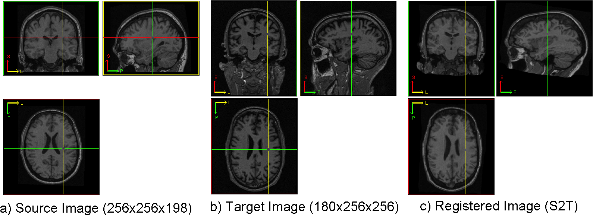

.. raw:: html

   <!--

   ============================================================================

      DO NOT EDIT THIS FILE! It was generated using Sphinx from:

      Origin:   $URL: https://sbia-svn.uphs.upenn.edu/projects/DRAMMS/branches/dramms-1.4/doc/tutorials/BrainWithSkull.rst $
      Revision: $Rev: 1900 $

   ============================================================================

   -->

.. title:: Registration of Raw Brain Images (with Skull) by DRAMMS

Tutorial 4: Raw Brain MR Images (with Skull, Different FOV and Background Noise)
=================================================================================

Introduction
-------------

Registering the raw brain images is a much more difficult problem than registering brain images without the skull or background noise. It is useful for propagating of brain masks, for aligning non-brain structures, and is needed in case skull-stripping fails. 

Major challenges include: 1) large inter-subject variations; 2) large amount of background noise and inhomogeneity during image scanning; 3) different fields-of-view (FOVs), where one image may contain more content than the other image, like the example shown below (the neck and nose are present in the target image but not the source image).

Result
------

   
.. _fig3b_3DHealthyBrain_RawImageWithSkull:

   
   Registration of raw 3D brain MR images from two different subjects. The source and target images are from different datasets -- raw, having skull and background noise/sparkles, and having different fields-of-views (FOVs).

   
   
   
Command
-------

::

    dramms -S src_rawbrain1.nii.gz  -T trg_rawbrain2.nii.gz  
           -O src2trg.nii.gz        -D def_src2trg.nii.gz  
		   
		 
		 
		   
Other Options
-------------

If two raw images are from the same dataset, the default parameter setting above usually gives reasonable results. 

If two raw images are from different datasets, and/or from different institutions, the default parameters still work successfully in a majority of the cases (>85% in our 300+ tests), just like the figure shown above. 

In the extreme cases (when the FOVs are too different, when the background noises are too much, when the inter-subject difference is too large), the default parameters may fail. In these extreme cases, we can make DRAMMS work again in most cases by the following two options. 

The **first** option is to enlarge the search range, i.e., setting bigger values in ``-x``, ``-y``, ``-z`` options in dramms command. A rule of thumb is to set ``-x`` value to be ``int(imageSizeX/35)``, ``-y`` value to be ``int(imageSizeY/35)`` and ``-z`` value to be ``int(imageSizeZ/40)``. For example, if the target image is 256 x 180 x 256, then one can first try all settings default::

    dramms   -S source.nii.gz   -T target.nii.gz 
             -O S2T.nii.gz 
             -x 7    -y 5    -z 6
			 
Here the ``-x``, ``-y`` and ``-z`` values are determined according to the above mentioned rule of the thumb.

The **second** option is to increase the threshold for the background noise through the ``-t`` option. This option sets an intensity threshold (in the [0, 255] range). Only those voxels having intensities (after normalizing to the [0 255] range) above this threshold are used to calculate the deformation. By default, the threshold is set at 12. In case the background noise is too strong, we can set it to 25, as the example shows below::

    dramms   -S source.nii.gz   -T target.nii.gz 
             -O S2T.nii.gz      -t 25

			 

Resources Needed
----------------

Registering this pair of 3D images (the target image has 180 x 256 x 256 voxels, 1.20 x 0.94 x 0.94 mm^3/voxel) takes 8.7 GB memory and finishes in 87 minutes in Linux OS (2.80GHz CPU).

If one can afford less memory, please use ``-u`` option to choose the memory usage in different levels (the lowest being about 1/4 of maximum memory used). This may however slightly reduce the registration accuracy.

.. Start a new page in LaTeX/PDF output after the changes.
.. raw:: latex

    \clearpage
