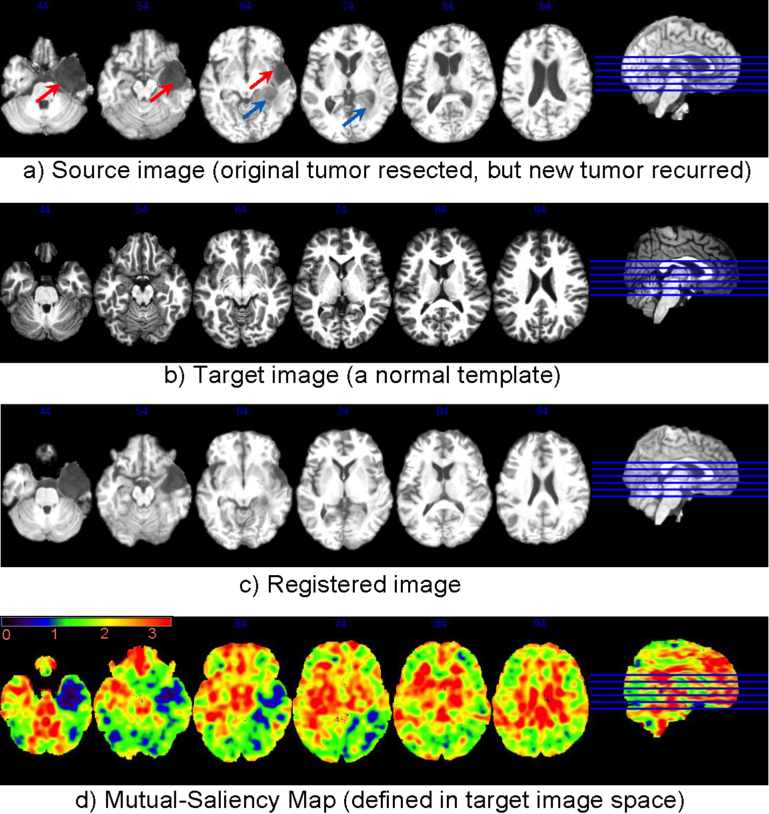
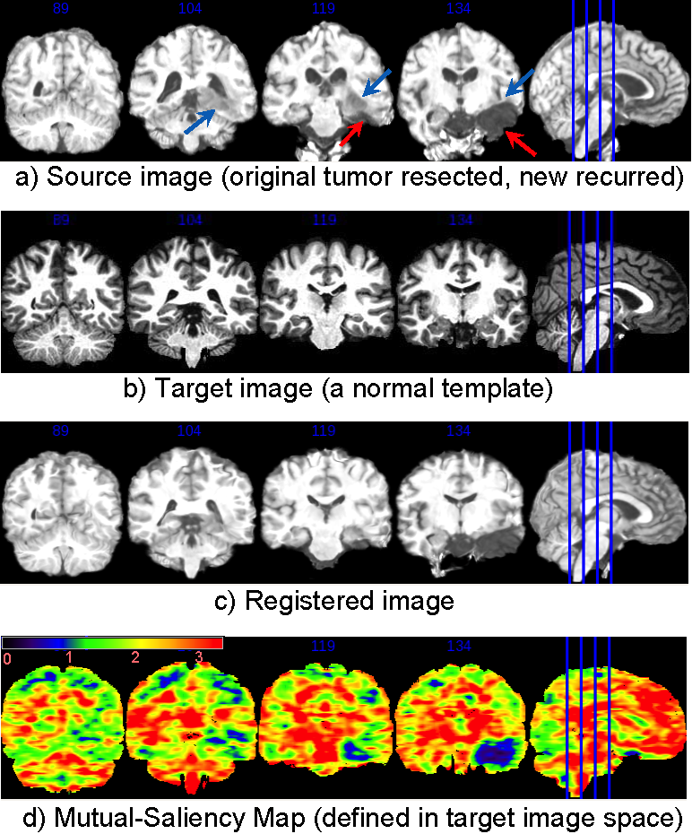

.. raw:: html

   <!--

   ============================================================================

      DO NOT EDIT THIS FILE! It was generated using Sphinx from:

      Origin:   URL: https://sbia-svn.uphs.upenn.edu/projects/DRAMMS/trunk/doc/BrainWithTumorRecurrence.rst 
      Revision: Rev: 1603 

   ============================================================================

   -->

.. title:: Brain Image with Recurrent Tumors Registered to the Normal Template by DRAMMS

Tutorial 7: Brain with Tumor Recurrence to a Normal Brain Template
====================================================================

Introduction
------------

Here we present an example of using DRAMMS to register an image with recurrent brain tumor to a healthy brain template. This will help us correlate the recurrence of tumor with the original occurrence of tumor in the normal template space. Another application is to do this for a population of brain tumor subjects, to observe which region is more likely to have tumor recurrence, and whether the recurrence follows connectivity or follows major vessels in a population study.

The main difficulties are missing correspondences: 

1) after the tumor resection, there is usually a blood pool in the place of the resected tumor (pointed out by the red arrows in the figure below), which is not found in the template image; 

2) around the tumor resection areas, there is usually some recurrent tumors (pointed out by the blue arrows in the figure below), which is also not seen in the template image. 

Result
------

The mutual-saliency component in DRAMMS helps alleviate this problem. DRAMMS automatically finds those regions that have less chance to find correspondences cross images, and use them with less weight/confidence during registration. For example, Fig. (d) shows that the mutual-saliency map has effectively assigned low weights in the regions in the target image space that correspond to outlier regions in source image space (Fig. (a)). The nice thing is that, this mutual-saliency calculation is fully automatic, doesn't need prior knowledge, or pre-segmentation of tumor or other outlier regions, and also doesn't need any human intervention or initialization.

.. _fig3d_3DTumorBrain_RecurrenceNormalizationToTemplate:

   
   Registration of a brain image with recurrent tumors to a normal brain template. Without segmentation/initialization/prior-knowledge, The automatically-calculated mutual-saliency map (d), defined in target image space, has effectively assigned low weights to those regions that correspond to the outlier regions (pointed out by arrows) in the source image (a). This way, the negative impact of outlier regions is largely reduced. Registration is mainly guided by regions that can establish good correspondences.
   
   
Now change to coronal view. Same legend.
   

   

Command
-------

::

    dramms -S src_Cardiac1.img  -T trg_Cardiac2.img
           -O src2trg.hdr       -D def_S2T.nii.gz  
           -g 0.4   -c 2

Resources Needed
----------------

Registering this pair of 3D images (target image 256x256x181 voxels, 1.0x1.0x1.0 mm^3/voxel) takes 8.8 GB memory and finishes in 33 minutes in Linux OS (2.80GHz CPU).

If one can afford less memory, please use ``-u`` option to choose memory usage in different levels (the lowest being about 1/4 of maximum memory used). This may however slightly reduce registration accuracy.

Note
----

In this example, we only presented registration of images with tumor recurrence. We have tried to use DRAMMS for registering original tumor images. Sometimes DRAMMS succeeded, and sometimes DRAMMS failed. The main difference is that, the original tumors often occupy larger space, and present more mass effect, edema infiltration that further complicate the problem. So it seems fair to say that DRAMMS is good at registering images with vascular lesions, acceptable for images with small number, small size and less infiltration tumors, but may fail for images with large number, large size and large mass effect tumors.

.. Start a new page in LaTeX/PDF output after the changes.
.. raw:: latex

    \clearpage