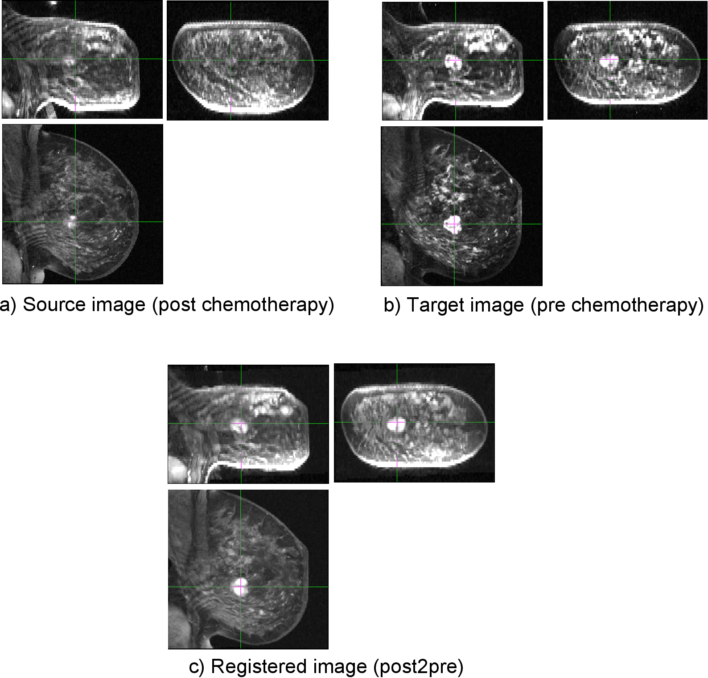
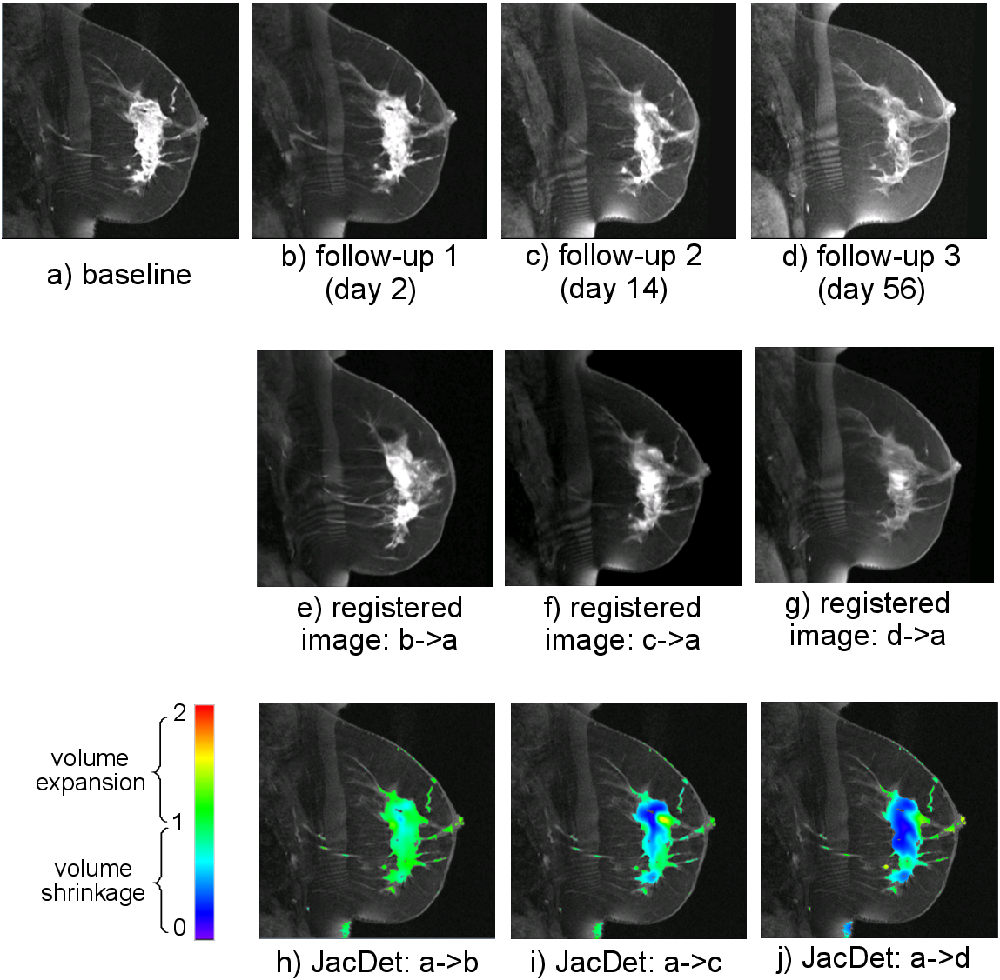

.. raw:: html

   <!--

   ============================================================================

      DO NOT EDIT THIS FILE! It was generated using Sphinx from:

      Origin:   $URL: https://sbia-svn.uphs.upenn.edu/projects/DRAMMS/branches/dramms-1.4/doc/tutorials/BreastLongitudinal.rst $
      Revision: $Rev: 1899 $

   ============================================================================

   -->

.. title:: Registration of Longitudinal Breast Cancer Images and Quantification of Breast Cancer Changes by DRAMMS

.. meta::
   :description: Using DRAMMS to register longitudinal images of a breast cancer patient. This offers the opportunity to quantify cancer changes at the voxel level, which is important to evaluate treatment effects.
   :keywords: Breast Image Registration, Longitudinal Registration, Breast MRI, Breast Cancer Change, Treatment Effect.
   

Tutorial 11: Longitudinal Breast Cancer MR Images
==================================================

Introduction
------------

Registration is often needed to quantify breast cancer change over time. This is especially important to monitor the change of breast cancer patient, and access their response to the chemotherapy (treatment effects). It is also one of the first steps towards differentiation between complete responders (subjects who show the absence of any residual invasive cancer in the breast and the absence of any metastatic cells in the regional lymph nodes) and non-complete-responders. 

Below is an example. DRAMMS recovers the deformation from post to pre chemotherapy in this breast cancer patient.

Result
------

.. _fig3h_3DBreast_CancerGrowth:

   
   Registration of breast cancer images for the same subject, to monitor the effect of chemotherapy in altering breast cancer over time.
   
   
   

Command
-------

::

    dramms -S src_breastPost.hdr  -T trg_breastPre.hdr 
           -O src2trg.nii.gz      -D def_S2T.nii.gz     -g 0.3
		   

Resources Needed
----------------

Registering this pair of 3D images (target image 256 x 256 x 64 voxels, 0.78 x 0.78 x 2.30 mm^3/voxel) takes 9.1 GB memory and finishes in 81 minutes in Linux OS (2.80GHz CPU).

If one can afford less memory, please use ``-u`` option to choose memory usage in different levels (the lowest being about 1/4 of maximum memory used). This may however slightly reduce registration accuracy.

Clinical Application
---------------------

With the DRAMMS registration, we can recover the deformation/change over time at the voxel level. This is done by the Jacobian Determinant map calculated from the DRAMMS deformation (click here for :ref:`how to calculate Jacobian Determinant maps <JacobianCalculation>`). Below is an example. 

.. _fig3h_3DBreast_CancerGrowthJacobianMap:

   
   Quantification of the longitudinal cancer of a breast cancer patient, by the Jacobian Determinant maps derived from the DRAMMS-computed deformation.
   

.. Start a new page in LaTeX/PDF output after the changes.
.. raw:: latex

    \clearpage