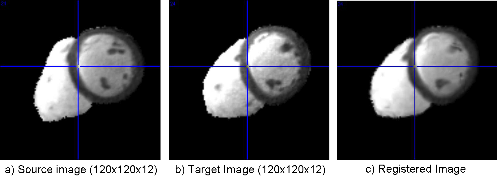

.. raw:: html

   <!--

   ============================================================================

      DO NOT EDIT THIS FILE! It was generated using Sphinx from:

      Origin:   $URL: https://sbia-svn.uphs.upenn.edu/projects/DRAMMS/branches/dramms-1.4/doc/tutorials/CardiacCrossSubjects.rst $
      Revision: $Rev: 1900 $

   ============================================================================

   -->

.. title:: Cardiac Image Registration (Cross-subject of Pure Heart) by DRAMMS

Tutorial 9: Cardiac MRI (Cross-Subject, Heart Regions only)
===============================================================

Introduction
------------

Registering cardiac images of different subjects can help us normalize a population of hearts into a common heart template space. It is the basis to the cardiac atlas construction and the atlas-based heart labeling. It is also one of the first steps for differentiating sub-populations (e.g., normal versus abnormal).

Result
------

.. _fig3e_3DCardiac_CrossSubjectStripped:

   
   Registration of a pair of 3D cardiac MR images (different subjects, short-axis, end-diastole). The non-heart structures have already been removed, making registration much easier than keeping all the non-heart structures.
   
   
   
Command
-------

::

    dramms -S src_Cardiac1.img  -T trg_Cardiac2.img
           -O src2trg.hdr       -D def_S2T.nii.gz 
		   

Resources Needed
----------------

Registering this pair of 3D images (target image 120 x 120 x 12 voxels, 1.25 x 1.25 x 8.0 mm^3/voxel) takes 0.6 GB memory and finishes in 2.3 minutes in Linux OS (2.80GHz CPU).

If one can afford less memory, please use ``-u`` option to choose memory usage in different levels (the lowest being about 1/4 of maximum memory used). This may however slightly reduce registration accuracy.

Note
-----

In this example, we have removed all non-heart structures to make registration feasible. When the non-heart structures are kept, especially when different images have different fields-of-view (FOVs) to include different regions of non-heart structures, registration across subjects will be much more difficult. In such cases, DRAMMS, like many other registration methods, may be subject to a high failure rate. 

Publication
------------

Yangming Ou, Dong Hye Ye, Kilian M. Pohl, Christos Davatzikos.
`Validation of DRAMMS among 12 Popular Methods in Cross-Subject Cardiac MRI Registration. <http://link.springer.com/chapter/10.1007/978-3-642-31340-0_22?null>`__
The Workshop of Biomedical Image Registration (WBIR) 2012: 209-219.

.. Start a new page in LaTeX/PDF output after the changes.
.. raw:: latex

    \clearpage