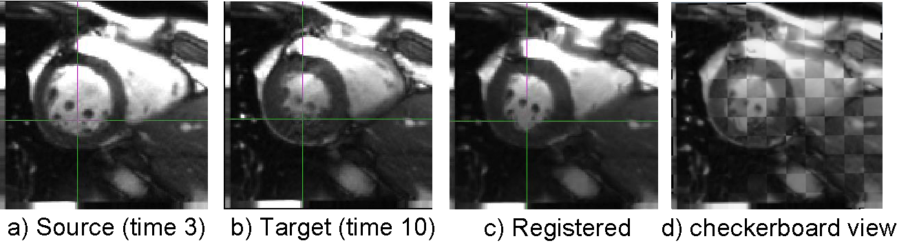

.. raw:: html

   <!--

   ============================================================================

      DO NOT EDIT THIS FILE! It was generated using Sphinx from:

      Origin:   $URL: https://sbia-svn.uphs.upenn.edu/projects/DRAMMS/branches/dramms-1.4/doc/tutorials/CardiacLongitudinal.rst $
      Revision: $Rev: 2050 $

   ============================================================================

   -->

.. title:: Longitudinal Cardiac Image Registration by DRAMMS for Cardiac Motion Analysis or Segmentation Propagation

Tutorial 10: Longitudinal Cardiac MRI
===============================================================

Introduction
-------------

Registering longitudinal cardiac images of the same subject can help us a) analyze cardiac motion, and also b) propagate heart labeling/segmentation over time.

The difficulty of registering longitudinal cardiac images of the same subject is in-between the difficulty in registering pure hearts and the difficulty in registering all structures (including non-heart structures) across subjects. 

	
.. raw:: html

     
	
Result A: for Cardiac Motion Analysis
--------------------------------------

A1. Cardiac motion analysis using DRAMMS registration.
  
.. only:: html  

    .. csv-table::
        :class: exampletoctable cardiacmotion

        |CardiacMotion| 
        
.. |CardiacMotion|      image::  CardiacMotionMovie.gif
                        :alt:    cardiac motion by DRAMMS.
                        :width:  105%
   					   

..  only:: latex

	A movie for DRAMMS-extracted cardiac motion can be accessed at `here <http://www.rad.upenn.edu/sbia/software/dramms/tutorials/CardiacLongitudinal.html>`__ .
	
	
.. raw:: html

     

A2. The key components explaining the above movie of using DAMMS registration to analyze cardiac motion (right click on the image to choose to view image in new tab or to zoom in for higher resolution).
	
.. _fig3g_3DCardiacMotion:

.. figure::   3g_3DCardiacMotion.jpg
   :alt:      figure of key components (refresh this webpage if the figure doesn't show up in the first time).
   :align:    center
   :width:    95%
   :figwidth: 95%

     
   
   
.. raw:: html

     
	

.. raw:: html

     
	
Result B: for Propagating Cardiac Label/Segmentation
-----------------------------------------------------
  
   
.. _fig3g_3DCardiacLongitudinal:

   
   Registration of longitudinal cardiac MR images for label/segmentation propagation.
   
   
.. raw:: html

     
	

Command
-------

For results in A1 (for cardiac motion analysis), we need a relatively smooth deformation, so we used `-g 0.4` below instead of the default 0.2. 

We can register all follow-up images (Tn) to the baseline image (T1) independently. Or, more preferably, register each follow-up image (Tn) to the baseline image (T1) with the initialization of the deformation obtained when registering the previous time point (T(n-1)) to the baseline image. The option `-d` as shown below allows the input of an initial deformation.

::

    dramms -S cineMRI_Tn.hdr  -T cineMRI_T1.hdr 
           -O cineMRI_Tn_to_T1.hdr 
           -D def_Tn_to_T1.nii.gz
           -g 0.4		   
           -d initial_def_T_n-1_to_T1.nii.gz		   

		   
For results in A2 (for label/segmentation propagation), we need a relatively aggressive deformation

::

    dramms -S src_CardiacTP3.hdr  -T trg_CardiacTP10.hdr 
           -O src2trg.nii.gz      -D def_S2T.nii.gz 

Resources Needed
----------------

Registering this pair of 3D images (target image 120 x 120 x 12 voxels, 1.25 x 1.25 x 8.0 mm^3/voxel) takes 0.95 GB memory and finishes in 2.4 minutes in Linux OS (2.80GHz CPU).

If one can afford less memory, please use ``-u`` option to choose memory usage in different levels (the lowest being about 1/4 of maximum memory used). This may however slightly reduce registration accuracy.

Publication
------------

Elena Bernardis, Ender Konukoglu, Yangming Ou, Dimitris Metaxas, Benoit Desjardins and Kilian Pohl.
`Temporal Shape Analysis via the Spectral Signature <http://link.springer.com/chapter/10.1007%2F978-3-642-33418-4_7>`__, International Conference on Medical Image Computing
and Computer Assisted Intervention (MICCAI), Nice, France, 1-5 Oct 2012.

.. Start a new page in LaTeX/PDF output after the changes.
.. raw:: latex

    \clearpage