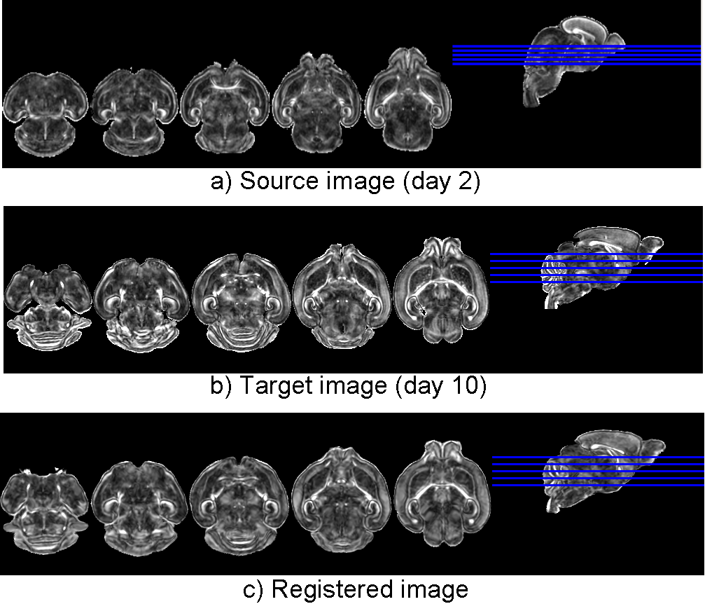

.. raw:: html

   <!--

   ============================================================================

      DO NOT EDIT THIS FILE! It was generated using Sphinx from:

      Origin:   $URL: https://sbia-svn.uphs.upenn.edu/projects/DRAMMS/branches/dramms-1.4/doc/tutorials/MouseBrainLongitudinal.rst $
      Revision: $Rev: 1900 $

   ============================================================================

   -->

.. title:: Longitudinal Mouse Brain Registration by DRAMMS

Tutorial 8: Longitudinal Mouse Brain MR Images
==============================================

Introduction
-------------

Due to the its similarity to human brain and its relative structural simplicity compared to the human brain, we often study mouse brain development to infer human brain development. Registration is thus needed to recover the change of mouse brain images at different time points. Challenges are large structural change, and the development of new structures. In the example below, the younger brain has not yet developed sophisticated cerebellum structures than the other relatively older brain.

Result
-------

.. _fig3k_3DMouseBrain_MouseDevelopment:

  
   Registration of longitudinal mouse brain images to follow mouse brain development.
   
   

Command
--------

::

    dramms -S src_mouseDay2.hdr   -T trg_mouseDay10.hdr 
           -O src2trg.nii.gz      -D def_S2T.nii.gz      
           -g 0.2  -c 2

Other Options
-------------		   

If the default parameter does not give good results, it is usually caused by the structural difference in different life stages. That is, structures may change greatly in shape, size and texture, and new structures may emerge as the brain grows. 

Possible solutions include 

1) to increase the search range in DRAMMS (setting the control point spacing via the ``-x``, ``-y`` and/or ``-z`` options); 

2) to use the initialization to de-couple a large deformation into several smaller ones (usually known as "geodesic registration"). In such case, one can use deformation from A to B to better initialize the calculation of the deformation from A to C (suppose A,B,C are in time order). DRAMMS can take initial deformation by the ``-d`` option. That is,

   From time A to B::
  
    dramms -S timeA.hdr    -T  timeB.hdr
           -O timeA2B.hdr  -D  def_timeA2B.nii.gz 
           -g 0.2  -c 2

   From time A to C using A_to_B as the initialization (``"-d"`` option)::
  
    dramms -S timeA.hdr    -T  timeC.hdr
           -O timeA2C.hdr  -D  def_timeA2C.nii.gz
           -g 0.2  -c 2
           -d def_timeA2B.nii.gz		   
		   
		   
	
Resources needed
-----------------

Registering this pair of 3D images (target image 300 x 300 x 200 voxels, 0.0625 x 0.0625 x 0.0625 mm^3/voxel) takes 8.6 GB memory and finishes in 43 minutes in Linux OS (2.80GHz CPU).

If one can afford less memory, please use ``-u`` option to choose memory usage in different levels (the lowest being about 1/4 of maximum memory used). This may however slightly reduce registration accuracy.

.. Start a new page in LaTeX/PDF output after the changes.
.. raw:: latex

    \clearpage