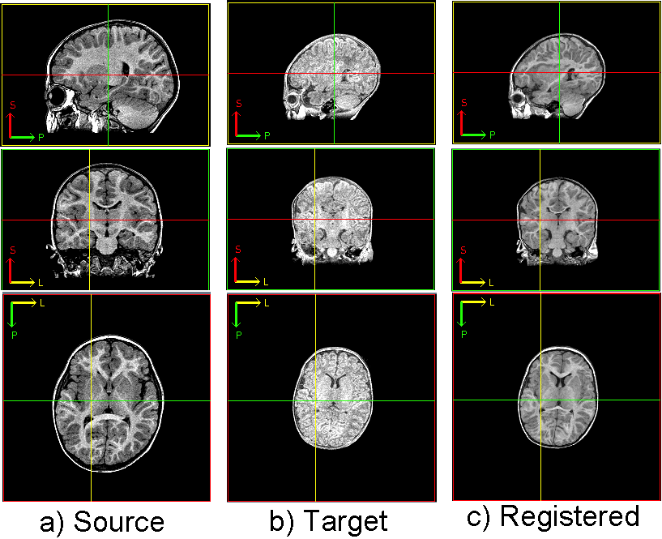

.. raw:: html

   <!--

   ============================================================================

      DO NOT EDIT THIS FILE! It was generated using Sphinx from:

      Origin:   $URL: https://sbia-svn.uphs.upenn.edu/projects/DRAMMS/branches/dramms-1.4/doc/tutorials/PediatricBrainLongitudinal.rst $
      Revision: $Rev: 1900 $

   ============================================================================

   -->

.. title:: Pediatric Brain Image Registration by DRAMMS

Tutorial 5: Longitudinal Pediatric Images
=========================================

Introduction
-------------

Registration is needed to follow the pediatrics brain development. Or, we use registration to propagate the skull-stripping and tissue/structure segmentation from one time point to another time point.

In this longitudinal pediatric brain registration task, the main difficulty is the large change of anatomical structure over time, and even development of new structures. Image contrast is also different, as shown in the figure below.

Result
------

.. _fig3l_3DPediatricBrain_BabyGrowth:

   
   Registration of longitudinal images of a same baby, to follow brain development.
   
   
   
   
Command
-------

::

    dramms -S src_olderage.hdr    -T trg_youngerage.hdr 
           -O src2trg.nii.gz      -D def_S2T.nii.gz     -g 0.2
		   

		   
Other Options
-------------

If the structural change is too large, one can increase the search range by setting larger control point spacing via the ``-x``, ``-y`` and/or ``-z`` options. 

Resources Needed
----------------

Registering this pair of 3D images (target image 256 x 256 x 175 voxels, 1.0 x 1.0 x 1.0 mm^3/voxel) takes 8.2 GB memory and finishes in 30.5 minutes in Linux OS (2.80GHz CPU).

If one can afford less memory, please use the ``-u`` option to choose the memory usage in different levels (the lowest being about 1/4 of maximum memory used). This may however slightly reduce registration accuracy.

.. Start a new page in LaTeX/PDF output after the changes.
.. raw:: latex

    \clearpage