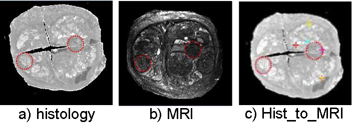

.. raw:: html

   <!--

   ============================================================================

      DO NOT EDIT THIS FILE! It was generated using Sphinx from:

      Origin:   $URL: https://sbia-svn.uphs.upenn.edu/projects/DRAMMS/branches/dramms-1.4/doc/tutorials/ProstateHist2MRI.rst $
      Revision: $Rev: 1986 $

   ============================================================================

   -->

.. title:: Prostate Histology-to-MRI Registration by DRAMMS

Tutorial 12: Histological and MR Images of The Same Prostate
===============================================================

Introduction
------------

Histological image, because of its *ex vivo* and *microscopic* nature, usually provides structural or pathological ground-truth. Finding MR regions corresponding to histological ground-truth regions will help us better understand how a certain structure or pathology appears in MRI. This is often the building block for future labeling or diagnosing new subjects from their MR images.

Histology and MRI registration is in general a very challenging multi-modality registration task. Difficulties are: 

1) completely different imaging protocols, intensity distribution and image contrasts. This often leads to the loss of a consistent relationship between the intensity distributions of two images, which violates the underlying assumption of mutual-information based classic multi-modality registration approach.

2) structural change due to loss of water (dehydration) in ex vivo histology preparation and section.

3) histological images are sectioned and scanned slice by slice, and stack to together. This sometimes known as 2.5D image has partially lost 3D integrity/continuity as seen in 3D MR images.

4) partial loss of correspondences (histological cuts) due to the sectioning during the acquisition of histological images.

Below we show an example of using DRAMMS to somehow alleviate some of those issues, mostly because of attribute matching design and mutual-saliency weighting components.

Result
------

.. _fig3j_3DProstate_Hisotology2MRI:

   
   Registration of multi-modality images of a same prostate. Dashed circles outline the corresponding structures.
   
   
   

Command
-------

::

    dramms -S src_histology.hdr   -T trg_MRI.hdr 
           -O src2trg.nii.gz      -D def_S2T.nii.gz      
           -g 0.25  -w 1   -c 2
		   

Here '-w 1' option tells dramms to use correlation coefficient (of the attribute vectors) as the similarity metric, instead of the default squared difference similarity metric. We recommend to use '-w 1' option in multi-modality registration jobs.

Other Options
--------------

Despite this successful example, registration of histological and MR images is very challenging task that even the affine registration may often fail. Because of the difficulty, DRAMMS may fail too. 

One solution is to carefully re-do affine registration outside DRAMMS scope. After having obtained a reasonable affine result, one can input the affinely registered images (src2trg_affine.nii.gz and trg.nii.gz) into DRAMMS. Meanwhile bypassing the affine part within DRAMMS by the ``-a 0`` option.

Resources Needed
----------------

Registering this pair of 3D images (target image 256 x 256 x 64 voxels, 0.16 x 0.16 x 0.4 mm^3/voxel) takes 6.7 GB memory and finishes in 39 minutes in Linux OS (2.80GHz CPU).

If one can afford less memory, please use ``-u`` option to choose memory usage in different levels (the lowest being about 1/4 of maximum memory used). This may however slightly reduce registration accuracy.

.. Start a new page in LaTeX/PDF output after the changes.
.. raw:: latex

    \clearpage